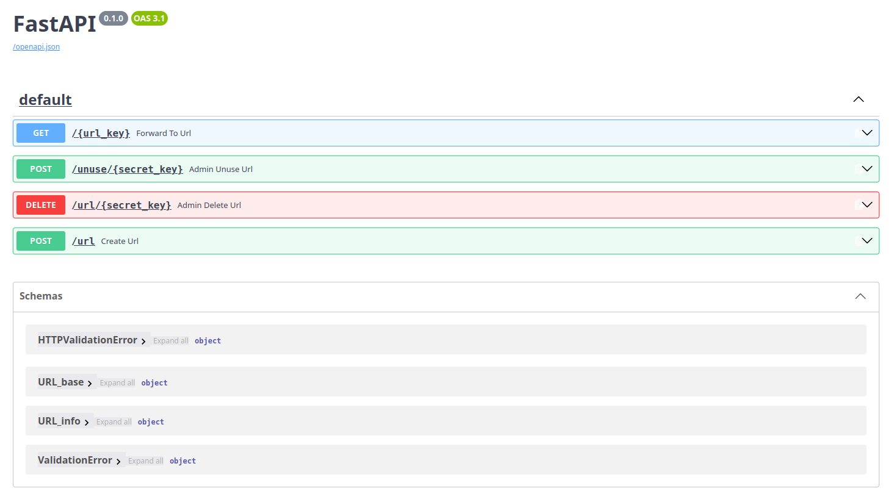

# link-shortener
A FastAPI link-shortener **learning project** with persistent storage.

---

### Configuring .env
```
#~/link-shortener/.env

ENV_NAME="[Choose a name]"
BASE_URL="[URL to the link shortener]"
DB_URL="[you db url]"
```
you can leave those empty or simply not have a .env, but, if you do, make sure it's at /link-shortener/.env

---

### Running the shortener
First, you'll need to have uv installed (since it's what I'm using in this project). 

Once you've installed uv, run:
```bash
$ uv sync
$ uv run fastapi dev
```

If your .env is empty you can just go to the link provided by uv and test the features on the /docs endpoint that FastAPI provides.

---

### Accessing via /docs
To use the shortener you'll need to (for now) access the /docs endpoint that FastAPI provides.

If you're running locally via uvicorn, access the url provided and go to the /docs endpoint. 



